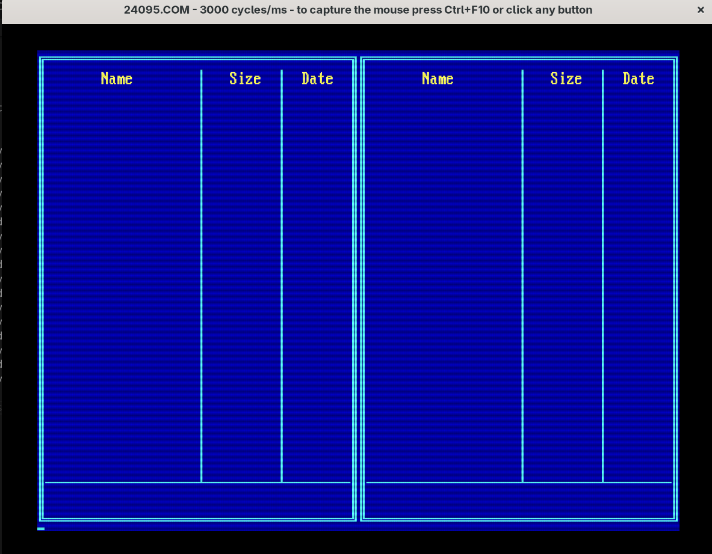
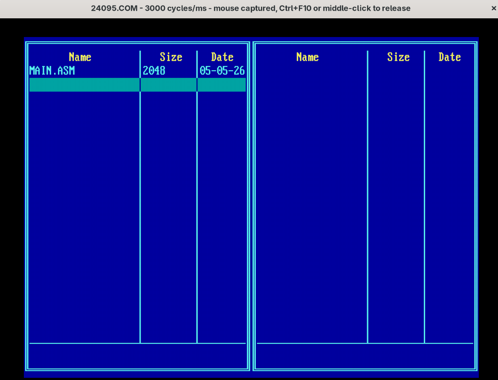
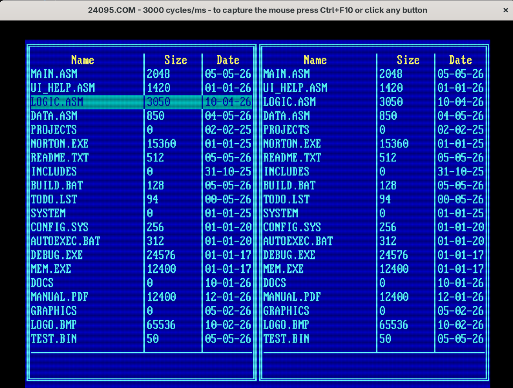

# Norton-Commander-Clone
A DOS-style text-based file manager built in x86 Assembly (8086 real mode). Inspired by Norton Commander.

## Features
- Dual-panel UI
- Keyboard navigation
- Directory browsing

#### Daily Progress Report

##### - Day-1
Starting out my file manager, will be building it slowly and thoroughly. The first steps for today are clearing
the screen and making it blue; copying the color schemes of the norton commander; and after that print two
distinct boxes that will split the screen into two panels...After that we will move to reading files and populating the panels
##### Report
I am done with the panes and the background, the screen is successfully divided into two different smaller screens.

##### - Day-2
For the day 2 my goal is to make resuable functions like draw horizontal, draw vertical that will take any character,
attribute the x and y position and print that character throughout the screen either horizontally or verically
Also i will make the functions that will take a null terminated string and print that anywhere on the screen.
The string can contain either alphabets or numbers or special characters, it does not matter.
I am yet not making the checks regarding file names or any other thing, we will come to that later. Right now i am just making a file viewer, i will add the options to add and remove files and make files and directiories later.

##### Report
I have successfully made the utility functions, print, print horizontal and print vertical, now that utility functions are done, its time to use the utility functions and complete the interface of the file manager

May 4th, 3:11 AM, ui done and it looks like this, now only the file extraction logic is left which is harder :)

##### - Day-3
Today i will move onto making the selection logic, the selection logic includes the highlight text and higlighting the window pane options based on the bar that the user is currently using, we will also add keyboard handling. Whenever user presses ↑ ↓ the highlight bar will move up and down and whenever the user presses the tab key the active window will change. One more important feature is that whenever the higlight bar moves, only the two active rows will refresh not the whole ui design

##### Report
Successfully made the text highligher that works on both panes seperately.

Working for pane 1

Working for pane 2

Now the manager is fully keyboard controlled
- pressing the down arrow move to the next row
- pressing the up arrow moves to the previous row
- pressing the tab changed the pain
- pressing the esc exits the program

###### important features
When at the last row, pressing the down arrow key moves to the first row of the file listings
similarly when at the first row, pressing the up arrow key moves to the last accessible file.

##### Next Steps
i cant jump straight onto the file reading logic from the System, i still have a long way to go because i still
have to figure out how will i handle navigation, how will i handle directories vs files so first of all i am 
going to create a list of fake files(no directories yet) than i will map those files to rows and also add the 
navigation meaning that if the number of file exceeds the limit of rows on which i can map them, i will scroll
down to view more and when i scroll back up the previous files will be loaded.
After i successfully do this, i will move onto the directories issue and than the file reading , file writing 
and file editing and if later i want i can also add a column showing the extensions of the files.

##### Solution to the problems
###### File Reading
Currently i am making mock data of lists of files. My mock file structure is as follows
 32-BYTE MOCK FILE SYSTEM DATA
- [0-12]  : Filename string (13 bytes max, null terminated)
- [13]    : Attribute (00h = Normal File, 10h = Directory)
- [14-17] : File Size (DWORD - 4 bytes)
- [18-19] : MS-DOS Date Word (Bits: YYYYYYY MMMMDDDDD)
- [20-21] : MS-DOS Time Word (Bits: HHHHHMMMMMMSSSSS)
- [22-31] : Reserved Padding (10 bytes)

 This is a clean 32-byte structure. The advantages of this structure are:
- Much faster: we dont have to use MUL instructions as we have just use shift instructions
- Memory Efficient: Very small RAM wastage as compared to 43-bytes DTA file structure

The original file structure that DOS extracts from the DOS API service INT 21h
- [0–20]  reserved
- [21]    attribute
- [22–23] time
- [24–25] date
- [26–29] size
- [30–42] filename ("FILE.TXT")

So right now we can use the mock file format as it is alot faster and later whem we use the original files we will create an intermediate subroutine that will extract the required data i.e name,date,size,format from the original file structure and format them in our structure so later we dont have to rewrite the entire extraction subroutine

##### - Day-5 Report

I have successfully implemented the file fetching system, but right now it is only for one single file, i still have to loop it and make it fetch all the files in the systems, on top of that the logic has yet to be refined right now what i am doing is i have made a helper function "print_character" and everytime for date and month i check if the date or month is less than 10, if yes i call the "print_function" two times and print the leading zeros on the exact spots, else i just print the dates and months straight up. One more thing is that to fomrmat the date i have to print the dashes i.e DD-MM-YY, so for these two dashes i am again calling the "print_character" funtions twice, so in short to print the date of one single file in the worst case, i have to call "print_character" function 4 times and i than have to call the "print_number" function 3 times to print the date,month and the year.

My next steps are first to make it into a loop so it fetches all the files instead of just one single file
and still i have to do something for the scrolling feature.

Now the entire list is fetched on both of the screens, now the only issue left is the addition of scrolling feature after that we can move forward and implement the navigation(path,folders etc) and the file reading and maybe editing feature

##### issue
When the size of the file is 1 Mb or greater the program stops, look into it as well